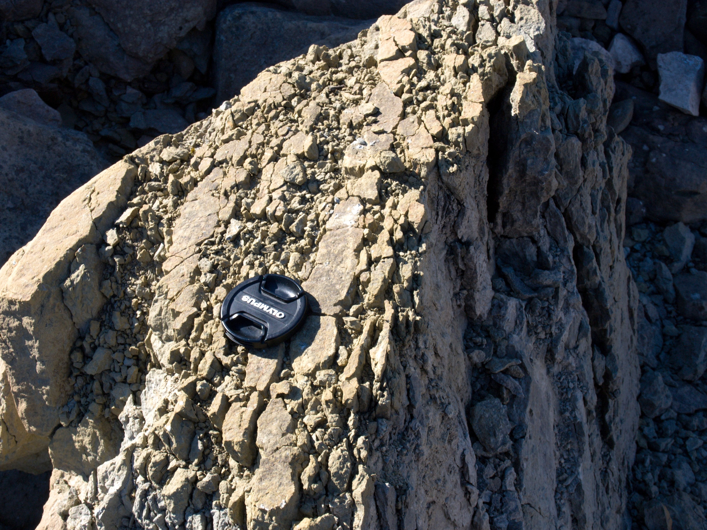
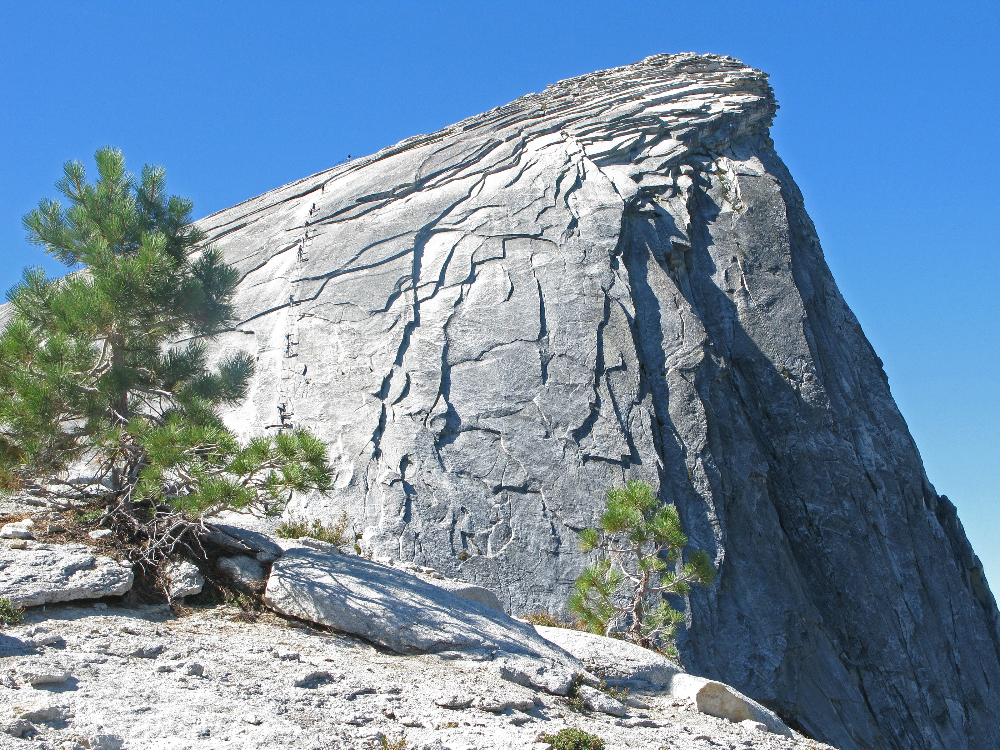
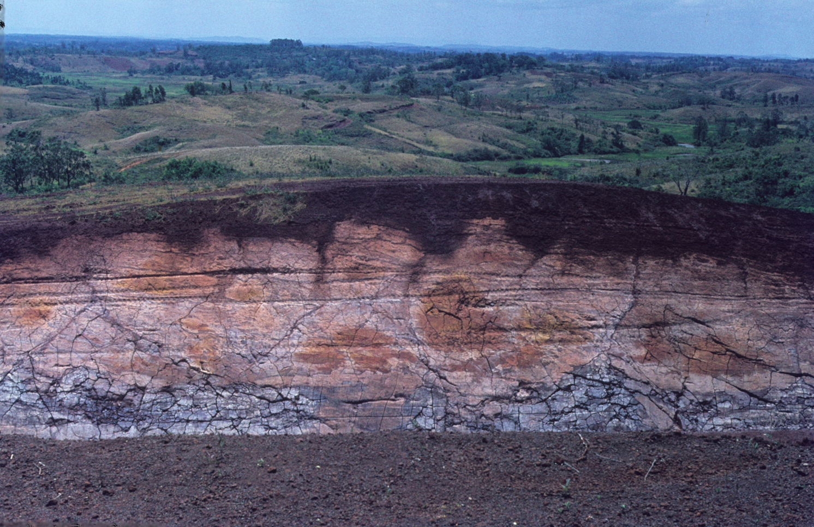

# Základní podstata zvětrávání

Zvětrávání je změna fyzikálních a chemických vlastností hornin po jejich obnažení na zemském povrchu. Produktem *zvětrávacích procesů* jsou *zvětraliny*. Ke změnám vlastností hornin dochází z důvodu odlišných fyzikálně-chemických podmínek při vzniku horniny a na zemském povrchu. Čím odlišnější podmínky panovaly při vzniku dané horniny, tím náchylnější je ke zvětrávání. Maximální možný dosah zvětrávacích procesů se udává okolo 1 km do hloubky. Zvětrávání hornin je přípravou pro další procesy.

# Fyzikální (mechanické) zvětrávání

Při fyzikálním zvětrávání dochází k rozrušování horniny a rozpadu na menší částice. Mění se tedy fyzikální vlastnosti hornin a ne chemické složení. U některých typů fyzikálního zvětrávání dochází až k rozpadu na jednotlivá minerální zrna. Příčinou jsou vždy změny objemu v horninovém masivu

## Změny teplot

Horniny a minerály jsou špatným vodičem tepla. Při oslunění skalního povrchu se tak během dne prohřeje jen pár svrchních centimetrů. Zároveň s růstem teploty horniny roste i její objem. Dramatické rozdíly mezi teplotou na povrchu a uvnitř tak způsobují pnutí v hornině, což vede k odlupování tenkých slupek hornin (tzv. *deskvamace*). Rozdílná teplotní roztažnost minerálů může způsobit vypadávání jednotlivých minerálních zrn tzv. *odzrňování*. Prudké zahřátí povrchu vlivem např. lesních požárů způsobuje *termické pukání* hornin. Silné ochlazení může naopak vyvolat *mrazové pukání*.

<figure id="fig:mrazove">
<figure>

</figure>
<figcaption>Ukázka mrazového tříštění, Svalbard.</figcaption>
</figure>

## Fyzikální zvětrávání vlivem růstu krystalů

Růst krystalů způsobuje objemové změny v horninách a jejich následné tříštění. Voda když zmrzne zvětší svůj objem o necelých [\\(\\SI{9,08}{\\percent}\\)]{.math .inline}, což vede k postupnému rozšiřování puklin a tříštění hornin (*gelivaci*). Produktem *makrogelivace* jsou například kamenná moře. *Mikrogelivace* způsobuje oddělování jednotlivých zrn horniny (produkt je kryopelit).

K tříštění hornin dochází i růstem krystalů soli z roztoků. *Solné tříštění* se hlavně uplatňuje u pórovitých hornin (např. pískovců) v aridních či příbřežních oblastech. Objemové změny krystalů mohou nastávat i z důvodu některých chemických změn (např. hydratace, dehydratace či oxidace).

## Fyzikální zvětrávání vlivem odlehčení (exfoliace)

*Exfoliace* je proces při kterém se z výchozů skalního podloží odlupují horninové slupky rovnoběžné s povrchem. Exfoliační pukliny vznikají z důvodu odlehčení hornin. Odstraněním nadloží se totiž v horninách uvolňuje napětí, které bylo indukované tíhou nadložních hornin. Nejčastěji jsou tyto pukliny při povrchu, avšak byly nalezeny i několik desítek metrů pod povrchem. Mocnost exfoliačních slupek se zpravidla pohybuje od 0,5 do 10 m, v takovém případě hovoříme o *makroexfoliaci*. Odlupování tenčích slupek (v řádu mm až cm) označujeme jako *mikroexfoliaci*.

Exfoliací vznikají exfoliační klenby. Nízké se nazývají *ruwary*, vysoké *bornhardty*.

<figure id="fig:exfoliace">
<figure>

</figure>
<figcaption>Ukázka exfoliace žuly. Half Dome v Yosemitském národním
parku. (Autor: Ronnie Macdonald, CC BY 2.0 )</figcaption>
</figure>

# Chemické zvětrávání

*Chemické zvětrávání* (také rozklad nebo dekompozice) je změna chemických vlastností hornin a jejich minerálů. Dochází k nahrazení stávajících minerálů jinými. Změna chemických vlastností je provázena i zvětšením objemu a zmenšením hustoty minerálů. Základní podmínkou pro chemické zvětrávání je *přítomnost vody* a dostatečná *teplota*.

Minerály, který vznikaly při podmínkách značně odlišných od těch co panují na zemském povrchu, zvětrávají rychleji, než ty které vznikaly za podmínek podobných. Tmavé (mafické) minerály zvětrávají na zemském povrchu rychleji než světlé (felsické) minerály. Tedy olivín a pyroxen zvětrává rychleji než muskovit či dokonce křemen. Tzv. *Goldichovo pravidlo zvětrávání* je v podstatě obráceným *Bowenovým krystalizačním schématem*, které znázorňuje pořadí minerálů krystalizujících z postupně chladnoucího magmatu. Ty minerály, které krystalizují při nejvyšších teplotách naopak nejrychleji podléhají zvětrávání. Samozřejmě v přírodních podmínkách to je poněkud komplikovanější.

Mobilita kationtů v minerálech ovlivňuje jak rychle se uvolní daný prvek z horniny, jak dlouho zůstává rozpuštěný ve vodě. Pořadí od nejmobilnějších k těm nejméně mobilním: [\\(\>\\)]{.math .inline} [\\(\>\\)]{.math .inline} [\\(\>\\)]{.math .inline} [\\(\>\\)]{.math .inline} [\\(\>\\)]{.math .inline} . Nejmobilnější kationy () jsou první, které jsou z hornin vyplavovány. Naopak málo mobilní kationy jako je zůstávají ve zvětralině, kde dochází postupně ke zvyšování jejich koncentrace.

## Typy chemického zvětrávání

Nejjednodušším typem chemického zvětrávání je *rozpouštění*. Rozpustnost minerálů je závislá na teplotě, pH a také na rychlosti proudění vody v horninových pórech. Například dešťová voda je díky rozpuštěnému lehce kyselá (pH = 5,7). Významné je rozpouštění vápenců, které vede ke vzniku krasových oblastí a výzdob.

Dalším typem chemického zvětrávání je *hydrolýza*. Ionty vody ( a ) Molekula vody se dělí na proton () a hydroxidový aniont (). Vodíkový kation nahrazuje v krystalické mřížce kationy kovů () a ty se slučují s hydroxidovým aniontem a stávají se součástí roztoku. Hydrolýza je hlavním procesem zvětrávání u silikátových hornin.

*Oxidace* je typem reakce, při které prvek nebo sloučenina ztrácí jeden elektron (zvyšuje se tak jeho oxidační číslo). Například železnaté sloučeniny se oxidují na železité ( na ). Oxidačním činitelem nemusí být jen kyslík, ale například trojmocné železo, čtyřmocný mangan aj., zkrátka ty ionty, které jsou schopny přijmout elektron od oxidované sloučeniny. Oxidace je dominantní u minerálů, které obsahují (pyrit, siderit atd.), ale také , , , . Opakem oxidace je *redukce*. Redukovaná sloučenina přibírá elektron. Redukčním činitelem jsou ty ionty, které mohou elektrony předávat (např. dvojmocné železo, dvojmocný mangan). Projevy oxidace a redukce lze ve zvětralině či půdě poznat podle barvy. Hnědé či červené zbarvení poukazuje na oxidační prostředí, jelikož je typickým znakem oxidů trojmocného železa, kdežto šedá až šedozelená barva je typická pro redukční prostředí.

*Hydratace* označuje proces obohacování minerálu vodou. Ta se dostává do krystalické mřížky. Sloučenina, která přijímá vodu, zvětšuje svůj objem a tím může mechanicky působit na své okolí. Opakem tohoto procesu je *dehydratace*.

*Karbonatizace* je reakce za účasti hydrogenuhličitanového anionu (). Ten se nachází ve vodě v důsledku rozpoučtění ve vodě a následné disociace kyseliny uhličité (): Karbonatizace je důležitá pro zvětrávání vápenců (reakce krasovění).

*Lateritizace* je proces, který je vázán na monzunové vnější tropy, kde je vyhraněné období sucha a vlhka. Během vlhkého období dochází k intenzivnímu rozpouštění minerálů a následné migraci a v roztoku a jejich relativnímu hromadění v různých hloubkách pod povrchem. Intenzivní výpar během sucha naopak způsobuje, že a se hromadí při povrchu v podobě sesquioxidů, které vytváří pevné kůry -- laterity.

<figure id="fig:laterit">
<figure>

</figure>
<figcaption>Zvětrávání bazaltového tufu (bílá barva) do saprolitu
(žluto-bílá) a lateritu (tmavě hnědá), Vangaindrano, Madagascar (Zdroj:
Werner Schellmann, CC BY-SA 2.5, via Wikimedia Commons)</figcaption>
</figure>

*Kaolinizace* je typický proces ekvatoriální humidní zóny. Jedná se o dlouhodobé zvětrávání ve slabě kyselém prostředí. Důležité je velké množství srážek a možnost odtoku vody. Kaolinizace způsobuje rozklad původní struktury minerálů (živec, slída\...). V místě (*in situ*) zůstávají stabilnější prvky ( a ). Produktem jsou kaolinické zvětraliny (kaolinit).

# Biologické zvětrávání

Zvětrávání v důsledku činnosti organismů může mít charakter fyzikálního, ale i chemické zvětrávání. Pod fyzikálním biologickým zvětráváním si snadno můžeme představit růst kořenů rostlin, a jejich rozrušování hornin (rozšiřování puklin mezivrstevních spár apod.). Chemické zvětrávání organismy spíše urychlují (např. zvýšené množství v důsledku dýchání).

# Zvětralinová pokrývka

Produktem zvětrávání je zvětralinová pokrývka. Její podoba je odvislá na typu zvětrávání. Fyzikální zvětrávání produkuje hrubší, ostrohranný materiál a naopak produkty chemického zvětrávání jsou daleko jemnější a mají hlinitojílovitý charakter. Mocnost zvětralinové pokrývky souvisí s charakterem podnebí, délce zvětrávání a samozřejmě s odolností horniny. Na svazích je mocnost zvětraliny menší než na rovinách. Zvětralinu, která je na místě svého vzniku (*in situ*) označujeme jako *saprolit*, naopak zvětralina, která je gravitačně přesouvána z vyšších částí svahu se nazývá *regolit*.

Kontrolní a klíčové otázky, na které bychom měli znát odpověď
-   Co je základem fyzikálního zvětrávání?
-   K řemu dochází při chemickém zvětrávání?

Další klíčové pojmy k zapamatování 
- oxidace 
- redukce
- laterit 
- saprolit
- regolit
