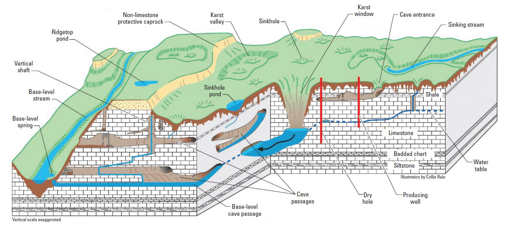

Území tvořená rozpustnými horninami podléhají *krasovění*, což je proces, při kterém dochází k rozpouštění horniny (korozi) agresivními vodními roztoky ale také modelaci fluviální, periglaciální a glaciální činností. Krasovými procesy vzniká specifická *krasová krajina*.

@demekObecnaGeomorfologie1987 mezi hlavní krasové pochody řadí:

-   rozpouštění krasových hornin

-   následné vylučování rozpuštěných látek a vznik např. krápníků

-   sesedání povrchu z důvodu rozpuštění hornin v podloží

-   krasové řícení

Je ovlivněn litologickými vlastnostmi hornin, klimatickými poměry,
morfostrukturní dispozicí a vzájemnou polohou rozpustných a
nerozpustných hornin

# Krasovění

Vývoj krasového reliéfu je závislý na mnoha faktorech. Hlavní jsou
litologie a klima.

## Litologie

Zásadní podmínkou pro vývoj krasu je samozřejmě přítomnost rozpustných a
propustných hornin. V nerozpustných horninách nemůže vzniknout kras.
Tvary podobné krasovým formám ale vzniklé v nerozpustných horninách se
nazývají *pseudokras*.

### Uhličitanové (karbonátové) horniny

Do této skupiny hornin spadá vápenec, krystalický vápenec, dolomit a
usazené či zpevněné horniny s vápnitým tmelem (písčité vápence, vápnité
pískovce). Hlavním rozpouštědlem je disociovaná kyselina uhličitá.
Intenzita krasovění je závislá na množství (parciálním tlaku)
(atmosférický a půdní) v roztoku. Přenos probíhá ve formě a opětovné
srážení se děje poklesem parciálního tlaku , tedy jeho únikem zpět do
atmosféry (např. v jeskyni). Rovnice krasovění:

Rovnice je reverzibilní, což znamená, že při vzrůstu teploty, poklesu
atmosférického tlaku nebo při působení rostlin dochází k uvolnění a
vysrážení v krystalické modifikaci (kalcit, aragonit), v podobě pěnovců,
travertinů a sintrů.

### Evapority

Do evaporitů se řadí sádrovec, anhydrit, sůl kamenná. Hlavním
rozpouštědlem je voda. Intenzita krasovění evaporitů závisí na jejím
množství a rozpouštěcí síle, která je ovlivněna teplotou a nasyceností.

### Silikátové horniny

Mezi silikátové horniny patří křemence (kvarcity), metamorfované
kvarcity. Rozpouštědlem je opět voda. Hlavním mechanismem narušení
horniny je hydratace a mechanický odnos.

## Klimatické podmínky

Důležitý je obsah CO2 z atmosféry, půdy a biochemických procesů,
množství srážek a jejich rozložení během roku. V případě aridního
klimatu chybí srážky a vzniká nedokonalý kras. Studené klima zase
omezuje působení vody, neboť je po dlouhou dobu zmrzlá. Množství je
omezené. Vývoj krasu je také omezený.

V chladném oceánském, vysokohorském a niválním klimatu mírného humidního
klimatu je velké množství tavných vod z ledovců a sněhové pokrývky
(obsah je vyšší s rostoucí nadmořskou výškou a ve sněhové pokrývce, v
chladných vodách se totiž lépe rozpouští). Ta může po část roku
infiltrovat -\> intenzivní vývoj jeskyní (hlavně vertikální). Povrchové
tvary nebývají zachovány, neboť je ničí mrazové zvětrávání.

Tropické teplé a vlhké klima je velice příznivé pro rozvoj krasových
forem. Vysoká teplota totiž urychluje chemické reakce krasovění. Bujná
vegetace produkuje spoustu a po celý rok je dostupné velké množství
vody.

# Krasová geomorfologie

Krasovou krajinu můžeme rozdělit do několika typů.

*Holý* nebo *nepokrytý kras* se vyznačuje tím, že krasové horniny leží
bezprostředně na povrchu a nejsou pokryté ani zvětralinou ani vegetací.
Malé zbytky půdy se mohou nacházet v hlubokých žlabech a puklinách.
Tento typ krasu je v okolí Středozemního moře a na jeho vzniku se zřejmě
podílel i člověk odlesňováním [@demekObecnaGeomorfologie1987].

*Přikrytý kras* je typ, který má krasové horniny pokryté mocnou vrstvou
propustné zvětraliny a sedimentů. Příkladem je Moravský kras.

*Podzemní kras* se vyvíjí v krasovějících horninách, které jsou v
podloží nekrasových hornin. Předpokladem je, že se kras vyvíjí až po
překrytí mladšími horninami.

*Pohřbený kras* je kras, který se vyvíjel v minulosti. Následkem
překrytí krasových hornin nepropustnými sedimenty byl vývoj krasových
tvarů přerušen.

*Exhumovaný kras* je typ krasu, který navazuje na pohřbený. Pohřbením
došlo k přerušení vývoje. Následně ale došlo k odnosu nepropustných
sedimentů a vývoj krasu byl obnoven.

::: figure*
<figure><figcaption>image</figcaption></figure>{width="\\linewidth"}
:::

## Povrchové tvary

Povrchové tvary se nazývají souhrnně *exokras*.

### Škrapy

Nejmenší povrchovým tvarem jsou *škrapy* (*karren)*. Jedná se o malé
zařezy či rýhy a jiné vyhloubeniny. Pokud škrapy pokrývají větší plochy,
označují se jako *škrapová pole* (*karren field*). *Žlábkové škrapy* se
vyskytují na ukloněných površích. Jedná se o zhruba rovnoběžné žlábky v
rovnoměrných rozestupech orientované ve směru spádu. *Stružkové škrapy*
jsou drobné rýhy o hloubce 1 cm--2 cm, obdobné šířky a v délce do 0.5 m.
*Puklinové škrapy* jsou vázané na puklinové systémy, spáry mezi vrstvami
apod. Tvar a hustota škrapů je dána charakterem puklinových systémů,
jejich hustotou apod. *Mísovité škrapy* se vyskytují na horizontálních
površích. Jejich průměr je od několika centimetrů až po metry. Hloubka
se pohybuje od pár milimetrů až po cca půl metru. *Šlápovité škrapy* lze
také najít na plochých skalních površích. Jedná se o malé stupně široké
0.2 m--1.0 m a vysoké několik centimetrů. V půdorysu mají charakter
podkovy. *Zaoblené škrapy* vznikají pod vegetací či půdou. Charakterem
jsou podobné žlábkovým škrapům.

Větší, 2 m--4 m široké a řádově první metry hluboké přímočaré rýhy
nazýváme *bogazy*

{#fig:skrapy1 width="100%"}

### Závrty

*Závrty* patří již k větším povrchovým útvarům. Jsou to uzavřené deprese
rozličných rozměrů. Jejich šířka je zpravidla větší než hloubka. Svou
podobou mohou připomínat trychtýř nebo mísy. Průměr závrtů je v řádu
metrů až prvních stovek metrů. Na dně závrtů se nachází materiál
naplavený vodou mizící v závrtu. Závrty podle způsobu jejich vzniku
dělíme na:

-   disoluční

-   řícené

-   sufózní

-   subsidenční

*Disoluční závrty* vznikají v místech intenzivnějšího rozpouštění
(například na křížení dvou puklin). Rozpouštěním se snižuje povrch a
vzniká sníženina, která dokáže zachytávat větší a větší množství vody --
dochází tam k pozitivní zpětné vazbě. Vývoj disolučního závrtu ale může
být zastaven ucpáním odtoku ze dna závrtu nerozpustným materiálem.
*Řícené závrty* vznikají zřícením stropů podzemních prostor. Iniciální
stádia mají strmé stěny. Dalším vývoje ale mohou být rozšířené do
trychtýřovitého tvaru. Splavováním zvětralinového pokryvu a půdy do
podzemí prostřednictvím rozšířených puklin a sufozních kanálů vznikají
*sufózní závrty*. Vývoj *subsidenčních závrtů* je spojen s postupným
sesedáním nadložních hornin bez jejich znatelného porušení vznikají.

{width="100%"}

*Cenoty* jsou specifickou formou závrtů, které jsou vyplněny vodou.
Známé jsou cenoty například z poloostrova Yucatán.

{width="100%"}

### Uvala, polje a krasová údolí

*Úvala* vznikají spojením závrtů. Bývají protažené pokud sledují průběh
šikmě uložených vrstev nebo zlomu.

Plošně nejrozsáhlejší jsou *polje*. Označujeme tak velké, ze všech stran
uzavřené sníženiny, které mají strmé okrajové svahy a ploché dno. Polje
nabývá rozměrů větších úval až po stovky km^2^. Polje mohou být suchá,
jiná zas periodicky nebo celoročné vyplněná jezerem. Rozlišujeme tři
základní druhy. *Okrajová nebo hraniční polje* jsou ovlivněné řekou,
která přitéká z nekrasové oblasti. *Strukturní polje* jsou ovliněné
geologickou strukturou.

*Krasová údolí* mohou mít charakter slepých či poloslepých údolí.
*Poloslepá údolí* jsou uzavřená stěnou, za kterou pokračuje suché údolí.
Při vyšších vodních stavech může být uzávěrová stěna překonána a suché
údolí může být zaplavené. Pokud je stěna, která údolí uzavírá vysoká a
údolí za ní nepokračuje, jedná se o *slepé údolí*.

### Tropický kuželový kras

Teplé a vlhké oblasti jsou příhodné pro rozvoj krasu z důvodu
intenzivního chemického zvětrávání. Rychlý rozvoj závrtů vede k
destrukci původního povrchu a vzniku tzv. *kuželového krasu* (*cone
karst*). Kuželový kras je rozdělován do dvou základních typů: cockpit a
věžový kras.

*Cockpit* má charakter zaoblených kopečků a sníženin připomínající v
půdorysu mořské hvězdice. Svou podobou může připomínat i plato na vejce.

*Věžový kras* je typický vysokými věžemi -- *mogoty*. Ty jsou vysoké i
přes 100 m a mají strmé až převislé stěny.

## Podpovrchové tvary

Nejznámějším podpovrchovým tvarem jsou určitě *jeskyně*. Definic jeskyně
je několik. Záleží na úhlu pohledu. Obecně je jeskyně podzemní dutina
zcela nebo z velké části omezená matečnou horninou. Podle speleologů
musí jeskyně dovolovat vstup a průchod dospělému člověku (i plazením). Z
pohledu hydrogeologů musí umožňovat vodě turbulentní pohyb.

*Syngenetické jeskyně* (dutiny) vznikly současně se vznikem horniny
(např. lávové jeskyně). *Epigenetické jeskyně* naopak vznikly až
následnými procesy (krasovými, ale i nekrasovými).

Krasové jeskyně vznikají *korozní a erozní činností kolující vody* v
podzemní části krasových oblastí a jejich sekundárním vyplňováním
krasovými nebo nekrasovými hmotami.

Rozlišujeme tři stádia vývoje jeskyně: iniciální, zralosti a destrukce.

Jeskyně mohou být syngenetické a epigenetické.

Puklinové a vrstevní

Typy jeskyní podle příčného profilu *Vertikální jeskyně* jsou vázané na
svislé tektonické poruchy, kterými vtéká voda do podzemí a postupně je
rozšiřuje. Mají mnoho podob a rozměrů: propasti, komíny a podobně.

*Horizontální jeskyně* jsou často spojené s vývojem povrchové údolní
sítě. Mají hlavně horizontální nebo subhorizontální charakter: chodby,
koridory, haly dómy.

### Podpovrchové tvary - sekundární

Výplň jeskyně může být tvořena materiálem, který byl do ní naplaven
zvenčí (*alochtonní* materiál). *Autochtonní* hmoty jsou tvořené
resedimentací uhličitanu vápenatého (sintry) Výplň jeskyně nazýváme
speleotémy.

Do stropních speleotémů patří *brčka* (*straw stalaktite*), které jsou
základním tvarem stalaktitu, samotné *stalaktity*, ale i další formy
jako např. záclony a závěsy. Z kapek vody, která dopadá na podlahu
vznikají podlahové speleotémy. Rostou směrem vzhůru. Zde patří
*stalagmity*. Spojením proti sobě rostoucího stalaktitu a stalagmitu
vzniká *stalagnát*. Na podlahách jeskyň ale můžeme najít i další tvary
jako např sintrové hráze, sintrové náteky, sintrové kupy či gejzírové
stalagmity. Stěny jeskyň jsou pokryté různými sintrovými povlaky,
vodopády, výkvěty, štíty. Mezi volné sintrové tvary se řadí jeskynní
perly, vápencové škraloupy.

::: boxotazky
Kontrolní a klíčové otázky, na které bychom měli znát odpověď

-   Co je to krasovění?

-   Jaké faktory ovlivňují dynamiku krasových procesů?

-   Jaký je rozdíl mezi syngenetickou a epigenetickou jeskyní?
:::

::: boxslovnik
Další klíčové pojmy k zapamatování škrapy & závrt\
uvala & polje\
tropický kras & cockpit\
mogot & stalaktit\
stalagmit & stalagnát\
:::
